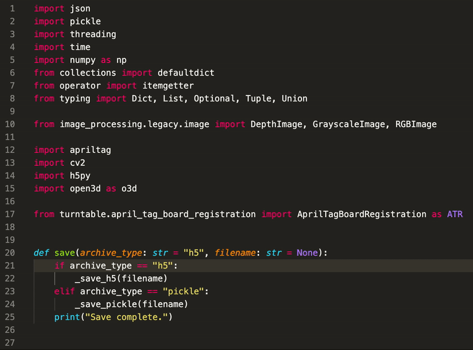

# reorder-python-imports

VSCode extension to sort and refactor python imports using
[`reorder-python-imports`](https://github.com/asottile/reorder_python_imports).

Unlike other import organizers, `reorder-python-imports` focuses on reducing the
frequency of merge conflicts, using static analysis to avoid the need for an active
venv, and providing better better compatibility with `pre-commit` and `black`.

To learn more,
[visit the original tool's homepage](https://github.com/asottile/reorder_python_imports).

## Features

Refactoring the imports is provided as a code action, which can be invoked by right
clicking on the code or the lightbulb icon and selecting `Reorder Imports`, or
selecting `Python Refactor: Reorder Imports` from the command palette.



### Reordering on Save

Reordering imports on save is also supported, but requires you to set the following in
your settings to prevent Microsoft's python extension from running `isort`:

```json
"[python]": {
    "editor.codeActionsOnSave": {
        "source.organizeImports": false,
        "source.organizeImports.reorder-python-imports": true
    },
}
```

## Requirements

`reorder-python-imports` must be installed in the venv used by visual studio.

## Known Issues

`isort` from Microsoft's Python Extension also provides a code action for organizing
imports. When vscode is configured to organize imports on save, both `isort` and
`reorder-python-imports` are run. To work around this, see the [reordering on save](#reordering-on-save) section.

## Release Notes

### v0.1.0

Added support and documentation for reordering on save. First feature-complete release.

### v0.0.1

Initial version with minimal required features - provided context menu and command through which the code action can be run.
